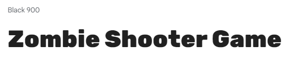

# **Zombie Shooter Game**

Visit the deployed website: [Zombie Shooter By DeadPixel Games]()

## **Project Description**

This shooting game is based on a whack-a-mole game setup and has been made to be easy to play for anyone, any age but leans more towards gamers and users with an interest with first person shooter games. I decided to create this kind of game as zombies are one of my interests/obsessions and I thought it would be fun to play.

## CONTENTS

* [User Experience](#user-experience-ux)
  * [User Stories](#user-stories)

* [Design](#design)
  * [Colour Scheme](#colour-scheme)
  * [Typography](#typography)
  * [Imagery](#imagery)
  * [Wireframes](#wireframes)
  * [Features](#features)
    * [Future Implementations](#future-implementations)
  * [Accessibility](#accessibility)

* [Technology Used](#technology-used)
  * [Languages Used](#languages-used)
  * [Frameworks, Libraries & Programs Used](#frameworks-libraries--programs-used)

* [Deployment & Local Development](#deployment--local-development)
  * [Deployment](#deployment)
  * [Local Development](#local-development)
    * [How to Fork](#how-to-fork)
    * [How to Clone](#how-to-clone)

* [Testing](#testing)
  * [Solved Bugs](#solved-bugs)
  * [Known Bugs](#known-bugs)
  
* [Credits](#credits)
  * [Code Used](#code-used)
  * [Content](#content)
  * [Acknowledgments](#acknowledgments)

--- 

## User Experience UX

- ### User Stories

- #### First Time Visitor Goals

  1. As a first time visitor, I want to be able to start the game easily & see how much time I have to do it.
  2. As a first time visitor, I want to have instructions on how to play which are quick and easy to get to.
  2. As a first time visitor, I would like to see some sort of scoring system to see how well I do.

- #### Returning Visitor Goals

  1. As a returning visitor, I want to be able to change the difficulty.

- #### Frequent Visitor Goals

  1. As a frequent visitor, I would like to change the theme/characters in the game.
  2. As a returning visitor, I would like the option to save my score to a leaderboard, to see how well I score against others or to keep a log of my own score.

---

### Design

- #### Colour Scheme

  For this project, I have chosen a palette of purples which fit with the spooky theme of zombies but is also pleasing to the eye and provides enough contrast between all the features to ensure the user has a pleasant time playing the game.
  The navigation bar is a lighter shade of purple, with a darker border at the bottom to really distinguish between the navigation element and the body of the page. Once the user is on a smaller screen size than laptop size, the navigation toggler button appears and this has been assigned a darker colour than the navigation bar so the user can distinguish where the button is. There is also a dark mode so the user can make the colours of the game page, darker. All buttons and menus have a black text colour as the purple on these elements are lighter than the background and this still provides enough contrast. On the How To Play page however, I have had to change the colour of all text on the page to be white to provide enough contrast for the user.

| Website Element                   | Colour           |
| --------------------------------- |:----------------:|
| Background of Navigation          | #c785ec          |
| Background of All Pages           | #634087          |
| Body Text & Icons                 | Black            |
| Button Hover                      | #deb7ff          |
| Dark Mode Navigation & Buttons    | #8549a7          |
| Dark Mode Background              | Black            |
| Dark Mode Button Hover            | #a86add          |
| How To Play Page Text             | White            |

- #### Typography

  Google Fonts was used to import the chosen fonts for use on the site.

  - For the Page Title and all text in the body of the website, I have used the google font Rubik due to it being easy to read and I have used the different font weights to change the look of the font for different areas of the site.

  
  

  I have also named the sans-serif font as a fallback font in case the other chosen fonts do not show for any reason.

- #### Imagery

  - For the headstones which the zombies pop out from behind, I have obtained a graphic from [Hiclipart](https://www.hiclipart.com/). For the zombies, I have downloaded free characters from [Craftpix.net](https://craftpix.net/freebies/free-zombie-villager-chibi-character-sprites/) and I used a favicon from [Favicon.io](https://favicon.io/emoji-favicons/biohazard/) using the biohazard symbol, fits really well with the zombie theme.

- #### Wireframes

  - Home Page Wireframes [Desktop](/documentation/wireframes/home-desktop.png) [Tablet](/documentation/wireframes/home-tablet.png) [Mobile](/documentation/wireframes/home-mobile.png)
  - How To Play Wireframe [Desktop](/documentation/wireframes/how-to-play.png)
  - Contact Us Wireframe [Desktop](/documentation/wireframes/contact-us-desktop.png) [Tablet](/documentation/wireframes/contact-us-tablet.png) [Mobile](/documentation/wireframes/contact-us-mobile.png)

## Technology Used

This project is written using HTML, CSS and JavaScript with JQuery in Gitpod. I have also used flex-box and bootstrap to make the site responsive, and it is currently being hosted on GitHub.

## Features

The website comprises of a homepage, where the main game element is contained, along with a how to play page and a modal pop-up to display the leaderboard.

- Responsive on all devices, using a mobile first approach.

- Resonsive & Interactive Menu/Toggler and links on all pages.

- Text logo on the nav element that also acts as a link back to the home page.

- User feedback on button(s) on the navigation element and below the game when hovered over.

#### Future Implementations

For future implementations I would like to:

1. Be able to introduce a harmless/victim character that would deduct points if clicked on/shot.
2. Following the above, it would be good to be able to have another character which is special and gains more points when clicked on/shot.
3. Be able to let the user change the theme of the game - this could not be done due to time constraints and skill level.
4. Add more intricacy to the difficulty setting so that it also changes the timings of the zombies popping up - this could not be done due to skill level and time constraints.
5. Add a leaderboard where the user can add and save their own score, and view others.

### Accessibility

I have been trying to make the project and website as accessible as possible. I have been doing this by:

* Using semantic HTML.
* Adding sr-only to the menu links so that screen readers know which page they are on.
* Applying the hover element on all buttons and the navigation toggler button (hamburger menu) on the site so that the user is aware they are hovering over a button.
* Ensuring that there is a enough colour contrast throughout the site and the background does not distract from the game or content.
* Displaying appropriate title on page tab, so users can easily see where they are on the site, just by looking at the tab.

### Languages Used

- HTML5
- CSS3
- Javascript

### Frameworks, Libraries & Programs Used

   + [Bootstrap 5.3.2:](https://getbootstrap.com/docs/4.4/getting-started/introduction/)
      - Bootstrap was used to create a responsive navigation menu to allow for a hamburger menu once the screen size reduced from desktop/
   + [Google Fonts:](https://fonts.google.com/)
      - Google fonts were used by importing the fonts ????????, into the style.css file which has been used on all pages within the project.
   + [jQuery:](https://jquery.com/)
      - jQuery comes with Bootstrap and makes the navbar responsive.
   + [Git](https://git-scm.com/)
      - The git command was used for version control via the terminal in Gitpod, to commit to Git and Push to GitHub.
   + [GitHub:](https://github.com/)
      - GitHub is used to save and store the files and projects code after being pushed from Git.
   + [Balsamiq:](https://balsamiq.com/)
      - Balsamiq was used to create wireframes.
   + [Google Developer Tools](https://developers.google.com/web/tools) 
      - To troubleshoot and test features, solve issues with responsiveness and styling.
   + [Am I Responsive?](http://ami.responsivedesign.is/)
      - To show the website home page image on a range of devices.

## Deployment & Local Development

### Deployment

The site is deployed using GitHub Pages - [Zombie Shooter Game]().

To Deploy the site using GitHub Pages:

1. Login (or signup) to Github.
2. Go to the repository for this project, .
3. Click the settings button.
4. Select pages in the left hand navigation menu.
5. From the source dropdown select main branch and press save.
6. The site has now been deployed, please note that this process may take a few minutes before the site goes live.

### Local Development

#### How to Fork

To fork the repository:

1. Log in (or sign up) to Github.
2. Go to the repository for this project, 
3. Click the Fork button in the top right corner.

#### How to Clone

To clone the repository:

1. Log in (or sign up) to GitHub.
2. Go to the repository for this project, 
3. Click on the code button, select whether you would like to clone with HTTPS, SSH or GitHub CLI and copy the link shown.
4. Open the terminal in your code editor and change the current working directory to the location you want to use for the cloned directory.
5. Type 'git clone' into the terminal and then paste the link you copied in step 3. Press enter.

- - -

## Testing

  Please click [HERE](testing.md) for all testing.

### Solved Bugs

| No   | Bug  | How I solved the issue |
| :--- | :--- | :--- |
| 1 | I tried to implement a custom crosshair cursor | I tried several different .png files which were different sizes, but none worked. As this is not a majorly important part of the project, I opted for the system crosshair cursor which works well |
| 2 | For the contact page, I wanted a map to be at the bottom of the content on that page and also for it to be responsive, I had placed an embedded map but it was only one size and did not look good within other device sizes | I typed my query into google and found a good [tutorial](https://www.w3schools.com/howto/howto_css_responsive_iframes.asp) on W3 schools which showed how to style the class for the map|
| 3 | The font for the navigation links would not change to the particular font I wanted | I researched this and managed to find [this article](https://forum.squarespace.com/topic/253132-custom-css-not-overriding-font-styles-site-nav-links/) where I learnt about the !important attribute and fixed this issue. This attribute was then used for other elements |

### Known Bugs

* When testing the game, I noticed that you could click on the same zombie more than once and gain extra points. If I had more time on this project, I would look to write extra JavaScript code to solve these issues.

* The user is able to click the start button multiple times (dismissing the pop up each time) and multiple sets of zombies pop up from behind the headstones. With more time and knowledge, I would look to fix this bug.

* When testing was carried out on an Iphone 12 mobile, the booking in form does not display correctly; the title is off center, the checkbox is left aligned for some reason and users have to scroll to the right slightly to view the end of the text box. This is all displayed correctly when viewing on a desktop and reducing the screen size either just through the browser or through devtools.

  

* I noticed the border style that I had applied to the menu links, applies itself to the full width on the hamburger menu but on the full desktop menu, the border is only as long as the navigation link word. This could be rectified just by spending further time on the project.

- - -

## Credits

### Code Used

* 
* 
* 
* 
* 
* 
* 
* 
* 
* 

### Content

### Acknowledgments

I would like to acknowledge the following people:

* 